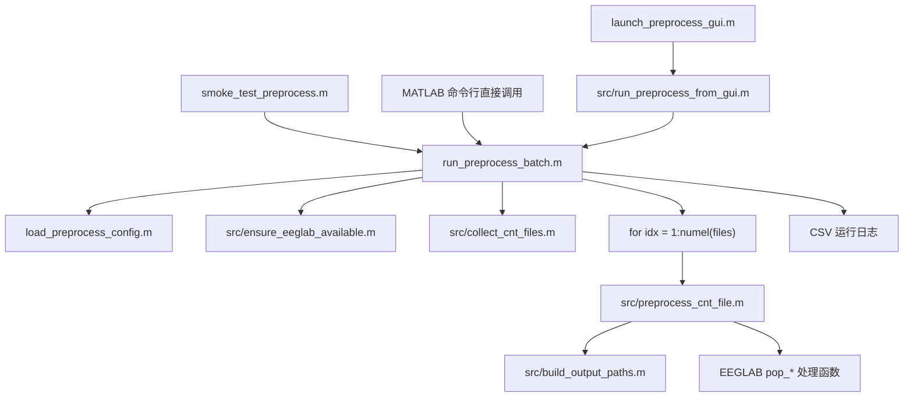

# 当前批量预处理流程与代码说明

本文档说明当前 `EEGPreProcessScript` 项目是如何完成 `.cnt` 文件批量预处理的，包括整体流程、关键代码、配置方式和实际使用方法。

当前脚本的“批量”不是并行启动多个 MATLAB 任务，而是：

1. 递归扫描源目录下所有 `.cnt` 文件。
2. 按文件路径排序。
3. 逐个文件调用同一个单文件预处理函数。
4. 每个文件独立捕获错误，失败不会中断整个批次。
5. 将每个文件的处理状态、输出路径、耗时等信息写入结果结构和 CSV 日志。

## 1. 主要入口文件

| 文件 | 作用 |
| --- | --- |
| `launch_preprocess_gui.m` | GUI 入口，提供目录选择、参数设置、烟雾测试和完整批处理按钮。 |
| `run_preprocess_batch.m` | 命令行批处理入口，也是 GUI 和烟雾测试最终调用的核心函数。 |
| `smoke_test_preprocess.m` | 一键烟雾测试入口，只处理 1 个 `.cnt` 文件。 |
| `load_preprocess_config.m` | 从 `config/preprocess_config.json` 读取配置，缺失时自动创建默认配置。 |
| `save_preprocess_config.m` | 保存配置到 JSON 文件。 |
| `src/run_preprocess_from_gui.m` | GUI 到批处理核心的桥接函数。 |
| `src/collect_cnt_files.m` | 递归收集源目录下的 `.cnt` 文件。 |
| `src/build_output_paths.m` | 根据源目录结构生成对应输出路径。 |
| `src/preprocess_cnt_file.m` | 对单个 `.cnt` 文件执行 EEGLAB 预处理。 |
| `src/ensure_eeglab_available.m` | 检查 EEGLAB 及所需函数是否可用。 |

## 2. 总体调用链

GUI、命令行和烟雾测试最终都会进入 `run_preprocess_batch.m`。



## 3. 批量处理是如何实现的

核心在 `run_preprocess_batch.m`。

### 3.1 加载配置并检查 EEGLAB

`run_preprocess_batch.m` 先把项目的 `src` 目录加入 MATLAB 路径，然后读取配置、应用覆盖参数，并检查 EEGLAB 所需函数。

```matlab
ensure_src_on_path();
source_root = string(source_root);
[config_path, overrides] = parse_inputs(varargin{:});
[log_callback, overrides] = extract_log_callback(overrides);

cfg = load_preprocess_config(config_path);
cfg = apply_overrides(cfg, overrides);
ensure_eeglab_available(cfg);
```

`src/ensure_eeglab_available.m` 会检查下面这些函数是否存在：

```matlab
required_functions = {
    'eeg_checkset'
    'pop_loadcnt'
    'pop_chanedit'
    'pop_select'
    'pop_resample'
    'pop_eegfiltnew'
    'pop_reref'
    'pop_saveset'
    };
```

如果 `cfg.eeglab_path` 有值，脚本会先 `addpath(genpath(...))`，再检查这些函数。

### 3.2 递归收集 `.cnt` 文件

批量文件列表由 `src/collect_cnt_files.m` 生成。

```matlab
listing = dir(fullfile(char(source_root), '**', '*.cnt'));
files = strings(numel(listing), 1);

for idx = 1:numel(listing)
    files(idx) = string(fullfile(listing(idx).folder, listing(idx).name));
end

files = sort(files);
```

这里的关键点是：

- `source_root` 必须是存在的目录。
- `**/*.cnt` 会递归查找所有子目录。
- `sort(files)` 保证每次运行的处理顺序稳定。

### 3.3 可用 `limit_files` 限制处理数量

`limit_files` 用于烟雾测试或小批量试跑。

```matlab
if cfg.limit_files > 0
    files = files(1:min(cfg.limit_files, numel(files)));
end
```

完整批处理时通常保持：

```matlab
cfg.limit_files = 0;
```

烟雾测试时会设置为：

```matlab
cfg.limit_files = 1;
```

### 3.4 逐个文件调用单文件预处理

真正的批量循环如下：

```matlab
results = repmat(empty_result(), numel(files), 1);

for idx = 1:numel(files)
    emit_log(log_callback, sprintf('[%d/%d] 正在处理 %s', idx, numel(files), char(files(idx))));
    started_at = tic;

    try
        current_result = preprocess_cnt_file(files(idx), source_root, cfg);
    catch err
        current_result = empty_result();
        current_result.input_file = files(idx);
        current_result.status = "failed";
        current_result.message = string(getReport(err, 'basic', 'hyperlinks', 'off'));
    end

    current_result.elapsed_seconds = toc(started_at);
    results(idx) = current_result;
    emit_result_log(log_callback, idx, numel(files), current_result);
end
```

这段代码决定了当前批处理的几个行为：

- 每个 `.cnt` 文件独立处理。
- 单个文件失败时记录为 `failed`，不会停止后续文件。
- 每个文件都会记录耗时 `elapsed_seconds`。
- 结果保存在 `results` 结构数组中。
- GUI 日志通过 `log_callback` 回传；命令行运行时也会打印到 MATLAB 命令窗口。

## 4. 单个 `.cnt` 文件的预处理流程

单文件处理在 `src/preprocess_cnt_file.m` 中完成。

### 4.1 先生成输出路径

```matlab
paths = build_output_paths(source_root, input_file, cfg.output_root);

result.input_file = input_file;
result.output_dir = paths.output_dir;
result.set_path = paths.set_path;
result.fdt_path = paths.fdt_path;
```

输出路径由 `src/build_output_paths.m` 负责生成。它会保留源目录下的相对层级，并在输出根目录下加一层源目录名。

例如：

```text
源目录:
F:\CJZFile\EEG_M1\Patient_tACS_M1_EEG

输入文件:
F:\CJZFile\EEG_M1\Patient_tACS_M1_EEG\基线\sub01\abc.cnt

输出根目录:
F:\CJZFile\EEG_scriptProcess

输出文件:
F:\CJZFile\EEG_scriptProcess\Patient_tACS_M1_EEG\基线\sub01\abc.set
F:\CJZFile\EEG_scriptProcess\Patient_tACS_M1_EEG\基线\sub01\abc.fdt
```

### 4.2 已存在输出时是否跳过

如果 `.set` 已经存在，且 `overwrite_existing = false`，脚本会跳过该文件。

```matlab
if isfile(paths.set_path) && ~cfg.overwrite_existing
    result.status = "skipped_existing";
    result.message = "输出已存在，且 overwrite_existing 为 false。";
    return;
end
```

需要重新覆盖处理时，将配置改为：

```matlab
cfg.overwrite_existing = true;
```

### 4.3 自动创建输出目录

```matlab
if ~isfolder(paths.output_dir)
    mkdir(char(paths.output_dir));
end
```

### 4.4 EEGLAB 预处理步骤

当前自动执行的是前六步预处理。

#### 第 1 步：导入 `.cnt`

```matlab
EEG = pop_loadcnt(char(input_file), 'dataformat', 'auto', 'memmapfile', '');
EEG = eeg_checkset(EEG);
```

#### 第 2 步：加载电极定位 `.ced`

```matlab
EEG = pop_chanedit(EEG, 'lookup', char(cfg.lookup_file));
EEG = eeg_checkset(EEG);
```

`cfg.lookup_file` 默认来自：

```text
config/preprocess_config.json
```

当前默认值是：

```text
F:\CJZFile\EEG_M1\standard_1005.ced
```

#### 第 3 步：按重参考模式删除通道

先由 `src/get_remove_channels_for_reference_mode.m` 决定要删除哪些通道。

```matlab
remove_requests = get_remove_channels_for_reference_mode( ...
    cfg.remove_channels, cfg.reference_mode, cfg.reference_labels);
remove_labels = existing_labels(EEG, remove_requests);
```

如果通道存在，则删除：

```matlab
if ~isempty(remove_labels)
    EEG = pop_select(EEG, 'nochannel', cellstr(remove_labels));
    EEG = eeg_checkset(EEG);
end
```

当前规则：

| `reference_mode` | 删除规则 |
| --- | --- |
| `average` | 删除 `HEO / VEO / EKG / EMG / M1 / M2`。 |
| `m1_m2` | 只删除 `HEO / VEO / EKG / EMG`，保留 `M1 / M2` 用于重参考。 |

#### 第 4 步：降采样

```matlab
if cfg.target_sample_rate > 0 && EEG.srate ~= cfg.target_sample_rate
    EEG = pop_resample(EEG, cfg.target_sample_rate);
    EEG = eeg_checkset(EEG);
end
```

默认采样率：

```matlab
cfg.target_sample_rate = 250;
```

#### 第 5 步：高通、低通和工频陷波

高通：

```matlab
if cfg.highpass_hz > 0
    EEG = pop_eegfiltnew(EEG, 'locutoff', cfg.highpass_hz, 'plotfreqz', 0);
    EEG = eeg_checkset(EEG);
end
```

低通：

```matlab
if cfg.lowpass_hz > 0
    EEG = pop_eegfiltnew(EEG, 'hicutoff', cfg.lowpass_hz, 'plotfreqz', 0);
    EEG = eeg_checkset(EEG);
end
```

固定 `49-51 Hz` 陷波：

```matlab
EEG = pop_eegfiltnew(EEG, ...
    'locutoff', cfg.notch_band_hz(1), ...
    'hicutoff', cfg.notch_band_hz(2), ...
    'revfilt', 1, ...
    'plotfreqz', 0);
EEG = eeg_checkset(EEG);
```

默认滤波参数：

```matlab
cfg.highpass_hz = 0.5;
cfg.lowpass_hz = 45;
cfg.notch_band_hz = [49 51];
```

#### 第 6 步：重参考

先由 `src/resolve_reference_targets.m` 根据模式决定传给 `pop_reref` 的目标。

```matlab
reference_targets = resolve_reference_targets( ...
    EEG.chanlocs, cfg.reference_mode, cfg.reference_labels);
EEG = pop_reref(EEG, reference_targets);
EEG = eeg_checkset(EEG);
```

规则如下：

| `reference_mode` | `pop_reref` 参数 | 含义 |
| --- | --- | --- |
| `average` | `[]` | EEGLAB 平均参考。 |
| `m1_m2` | `[M1索引 M2索引]` | 以 `M1/M2` 为参考。 |

`m1_m2` 模式会调用 `src/find_reference_channel_indices.m` 查找 `M1/M2` 的通道索引。如果原始数据中找不到对应标签，会报错并把该文件标记为 `failed`。

#### 第 7 步：保存 `.set/.fdt`

```matlab
[~, set_name, ~] = fileparts(char(paths.set_path));
EEG = pop_saveset(EEG, ...
    'filename', [set_name '.set'], ...
    'filepath', char(paths.output_dir), ...
    'savemode', 'twofiles');
```

保存成功后，结果状态会变为：

```matlab
result.status = "processed";
result.channel_count = double(EEG.nbchan);
result.sample_rate = double(EEG.srate);
```

## 5. 当前不会自动完成的步骤

当前脚本只自动完成导入、定位、删通道、降采样、滤波、重参考和保存。

下面这些步骤仍需要后续在 EEGLAB 中人工或半人工完成：

- 人工检查坏段。
- 人工或半人工选择坏通道。
- 坏通道插值。
- ICA 或其他需要人工判断的清理步骤。
- 最终人工质控。

## 6. 配置文件

默认配置文件路径：

```text
config/preprocess_config.json
```

当前默认配置等价于：

```json
{
  "output_root": "F:\\CJZFile\\EEG_scriptProcess",
  "lookup_file": "F:\\CJZFile\\EEG_M1\\standard_1005.ced",
  "eeglab_path": "",
  "target_sample_rate": 250,
  "highpass_hz": 0.5,
  "lowpass_hz": 45,
  "notch_band_hz": [49, 51],
  "remove_channels": ["HEO", "VEO", "EKG", "EMG"],
  "reference_mode": "average",
  "reference_labels": ["M1", "M2"],
  "overwrite_existing": false,
  "limit_files": 0,
  "save_log": true
}
```

配置加载逻辑在 `load_preprocess_config.m`：

- 如果配置文件不存在，自动用默认配置创建。
- 如果配置文件为空，自动重写默认配置。
- 读取 JSON 后会调用 `src/normalize_preprocess_config.m` 补齐缺失字段并校验参数。

配置保存逻辑在 `save_preprocess_config.m`：

- 保存前同样会调用 `normalize_preprocess_config`。
- 会把 MATLAB string / logical / 数组转换成 JSON 可写格式。

## 7. 如何使用

### 7.1 第一次使用前

在 MATLAB 中进入项目目录，并加入路径。

```matlab
cd('F:\CJZProjectFile\EEGPreProcessScript');
addpath(genpath('F:\CJZProjectFile\EEGPreProcessScript'));
```

确认 EEGLAB 可以被 MATLAB 找到。如果找不到，可以设置 `eeglab_path`：

```matlab
cfg = load_preprocess_config();
cfg.eeglab_path = 'F:\Matlab2020a\toolbox\eeglab2021.1';
save_preprocess_config(cfg);
```

根据实际位置修改电极定位文件：

```matlab
cfg = load_preprocess_config();
cfg.lookup_file = 'F:\CJZFile\EEG_M1\standard_1005.ced';
save_preprocess_config(cfg);
```

### 7.2 推荐方式：GUI 运行

启动 GUI：

```matlab
launch_preprocess_gui
```

操作顺序：

1. 点击 `选择源目录`，选择包含 `.cnt` 文件的上级目录。
2. 点击 `选择输出目录`，选择处理结果保存位置。
3. 检查或选择 `电极定位文件`，必须是存在的 `.ced` 文件。
4. 选择 `重参考方式`，默认是 `平均参考`。
5. 按需调整采样率、高通、低通、是否覆盖已有输出、是否保存日志。
6. 先点击 `烟雾测试`，只处理 1 个文件。
7. 用 EEGLAB 打开生成的 `.set` 文件抽查。
8. 确认后点击 `开始处理` 做完整批处理。

GUI 调用链是：

```text
launch_preprocess_gui.m
  -> src/run_preprocess_from_gui.m
      -> collect_gui_config(ui)
      -> validate_lookup_file_path(cfg.lookup_file)
      -> count_cnt_files(source_root)
      -> run_preprocess_batch(source_root, cfg)
```

### 7.3 命令行完整批处理

最简单用法：

```matlab
results = run_preprocess_batch("F:\CJZFile\EEG_M1\Patient_tACS_M1_EEG");
```

同时拿到汇总信息：

```matlab
[results, run_info] = run_preprocess_batch("F:\CJZFile\EEG_M1\Patient_tACS_M1_EEG");
disp(run_info)
```

指定输出目录和覆盖规则：

```matlab
[results, run_info] = run_preprocess_batch( ...
    "F:\CJZFile\EEG_M1\Patient_tACS_M1_EEG", ...
    "output_root", "F:\CJZFile\EEG_scriptProcess", ...
    "overwrite_existing", false);
```

只试跑前 3 个文件：

```matlab
[results, run_info] = run_preprocess_batch( ...
    "F:\CJZFile\EEG_M1\Patient_tACS_M1_EEG", ...
    "limit_files", 3);
```

切换为 `M1/M2` 重参考：

```matlab
cfg = load_preprocess_config();
cfg.reference_mode = "m1_m2";
cfg.reference_labels = ["M1" "M2"];
[results, run_info] = run_preprocess_batch( ...
    "F:\CJZFile\EEG_M1\Patient_tACS_M1_EEG", cfg);
```

### 7.4 命令行烟雾测试

默认烟雾测试：

```matlab
report = smoke_test_preprocess();
```

指定源目录：

```matlab
report = smoke_test_preprocess("F:\CJZFile\EEG_M1\Health-tACS-M1-RestingStateEEG");
```

烟雾测试内部会强制：

```matlab
overrides.limit_files = 1;
overrides.overwrite_existing = false;
```

## 8. 输出结果和日志

每个文件会得到一个结果结构，主要字段包括：

| 字段 | 含义 |
| --- | --- |
| `input_file` | 原始 `.cnt` 文件路径。 |
| `output_dir` | 输出目录。 |
| `set_path` | 输出 `.set` 文件路径。 |
| `fdt_path` | 输出 `.fdt` 文件路径。 |
| `status` | `processed`、`skipped_existing` 或 `failed`。 |
| `message` | 跳过原因或错误信息。 |
| `channel_count` | 保存时的通道数。 |
| `sample_rate` | 保存时的采样率。 |
| `elapsed_seconds` | 单文件耗时。 |

如果 `cfg.save_log = true`，批处理结束后会写 CSV 日志：

```text
<output_root>\logs\<source_name>_preprocess_log_<yyyymmdd_HHMMSS>.csv
```

日志文件由 `run_preprocess_batch.m` 内部的 `write_batch_log` 写出：

```matlab
log_dir = fullfile(char(output_root), 'logs');
timestamp = string(datestr(now, 'yyyymmdd_HHMMSS'));
log_name = source_name + "_preprocess_log_" + timestamp + ".csv";
result_table = struct2table(results);
writetable(result_table, char(log_path));
```

## 9. 常见参数修改示例

修改采样率和滤波：

```matlab
cfg = load_preprocess_config();
cfg.target_sample_rate = 250;
cfg.highpass_hz = 0.5;
cfg.lowpass_hz = 45;
save_preprocess_config(cfg);
```

关闭日志：

```matlab
cfg = load_preprocess_config();
cfg.save_log = false;
save_preprocess_config(cfg);
```

允许覆盖已有输出：

```matlab
cfg = load_preprocess_config();
cfg.overwrite_existing = true;
save_preprocess_config(cfg);
```

恢复完整批处理：

```matlab
cfg = load_preprocess_config();
cfg.limit_files = 0;
save_preprocess_config(cfg);
```

## 10. 排查要点

### 10.1 找不到 EEGLAB 函数

典型原因：

- EEGLAB 没有加入 MATLAB 路径。
- `eeglab_path` 为空或路径不对。
- EEGLAB 插件目录未被加入路径。

处理方式：

```matlab
cfg = load_preprocess_config();
cfg.eeglab_path = '你的EEGLAB根目录';
save_preprocess_config(cfg);
```

然后重新运行。

### 10.2 GUI 提示电极定位文件错误

`src/validate_lookup_file_path.m` 会检查：

- 路径不能为空。
- 文件必须存在。
- 扩展名必须是 `.ced`。

### 10.3 有些文件被跳过

检查 `status` 是否为：

```text
skipped_existing
```

如果是，说明输出 `.set` 已存在，并且：

```matlab
cfg.overwrite_existing = false;
```

需要覆盖时改为 `true`。

### 10.4 只处理了少量文件

检查：

```matlab
cfg.limit_files
```

完整批处理应为：

```matlab
cfg.limit_files = 0;
```

### 10.5 `m1_m2` 重参考失败

如果选择 `m1_m2`，脚本必须在当前 EEG 通道标签中找到 `M1` 和 `M2`。如果找不到，`src/find_reference_channel_indices.m` 会报错，该文件会在批处理结果中记为 `failed`。

## 11. 最小可复现运行模板

推荐正式处理前先执行这个模板：

```matlab
cd('F:\CJZProjectFile\EEGPreProcessScript');
addpath(genpath('F:\CJZProjectFile\EEGPreProcessScript'));

cfg = load_preprocess_config();
cfg.eeglab_path = 'F:\Matlab2020a\toolbox\eeglab2021.1';
cfg.output_root = 'F:\CJZFile\EEG_scriptProcess';
cfg.lookup_file = 'F:\CJZFile\EEG_M1\standard_1005.ced';
cfg.reference_mode = "average";
cfg.limit_files = 1;
cfg.overwrite_existing = false;

[results, run_info] = run_preprocess_batch( ...
    "F:\CJZFile\EEG_M1\Patient_tACS_M1_EEG", cfg);

disp(results)
disp(run_info)
```

确认 1 个文件输出正常后，再执行完整批处理：

```matlab
cfg.limit_files = 0;
[results, run_info] = run_preprocess_batch( ...
    "F:\CJZFile\EEG_M1\Patient_tACS_M1_EEG", cfg);
```

